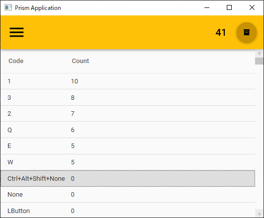
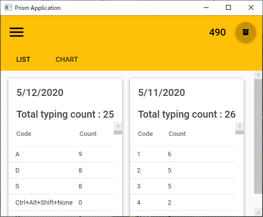
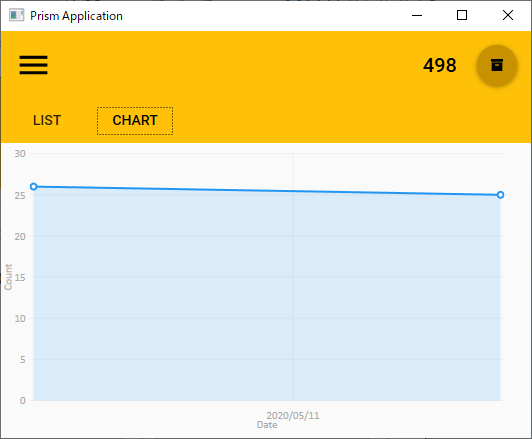
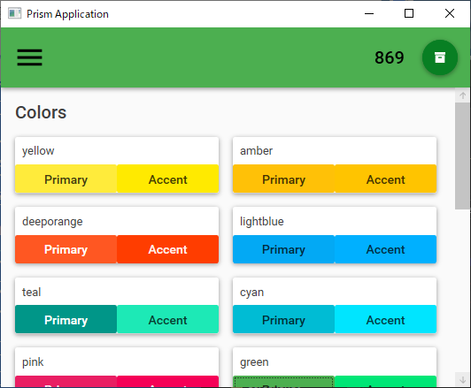

# TypingCounter

## 概要

Widnows 上のタイプ数をカウントする WPF アプリケーションです。  
キーボードフックを行う `KeyboardHook` クラスの実装は [ぬるり。](http://hongliang.seesaa.net/article/7539988.html) より引用しました。  

## 依存関係

[.NET Core 3.1](https://dotnet.microsoft.com/download)

## 開発環境

- Windows 10 (1903)
- Microsoft Visual Studio Community 2019 (Version 16.4.4)

## 使い方

### Current 画面

現在タイプ数をリアルタイムに一覧表示します。  
画面右上のボタンを押すと現在タイプ数をアーカイブしリセットします。  
アーカイブしたタイプ数は後述の `Archive` 画面にて確認できます。  

### Archive 画面

アーカイブしたタイプ数を表示します。  
「リスト」「チャート」のいずれかの表示形式をタブによって切り替えます。  
画面表示中にアーカイブするとリアルタイムに反映されます。  

### Setting 画面

各種設定を行います。  
現在はテーマカラーの変更のみ行えます。  
設定内容はリアルタイムに反映されます。